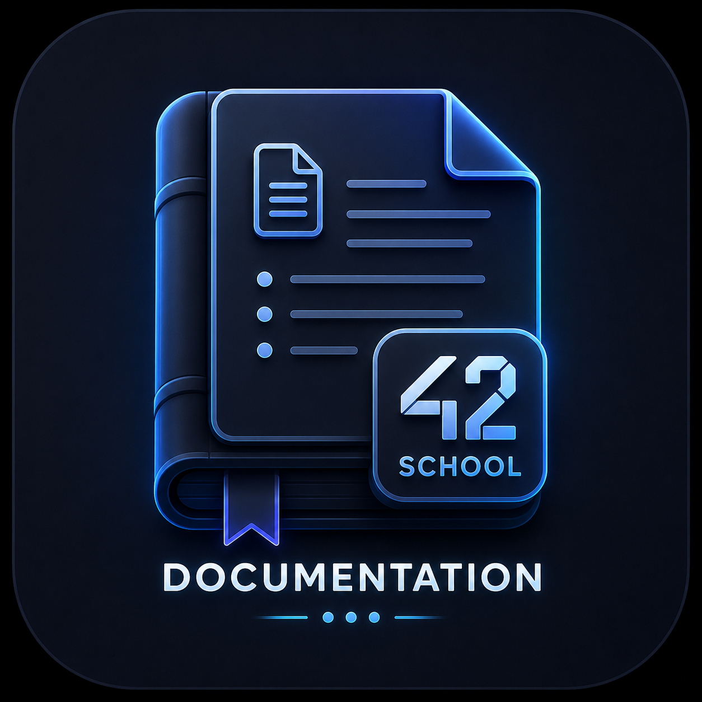
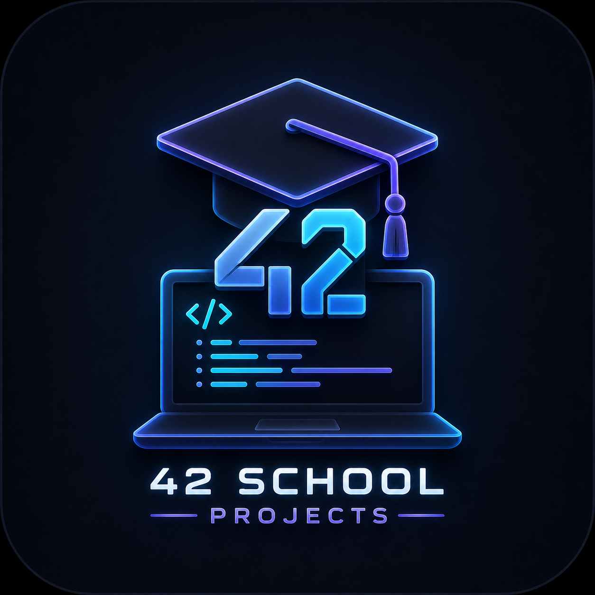
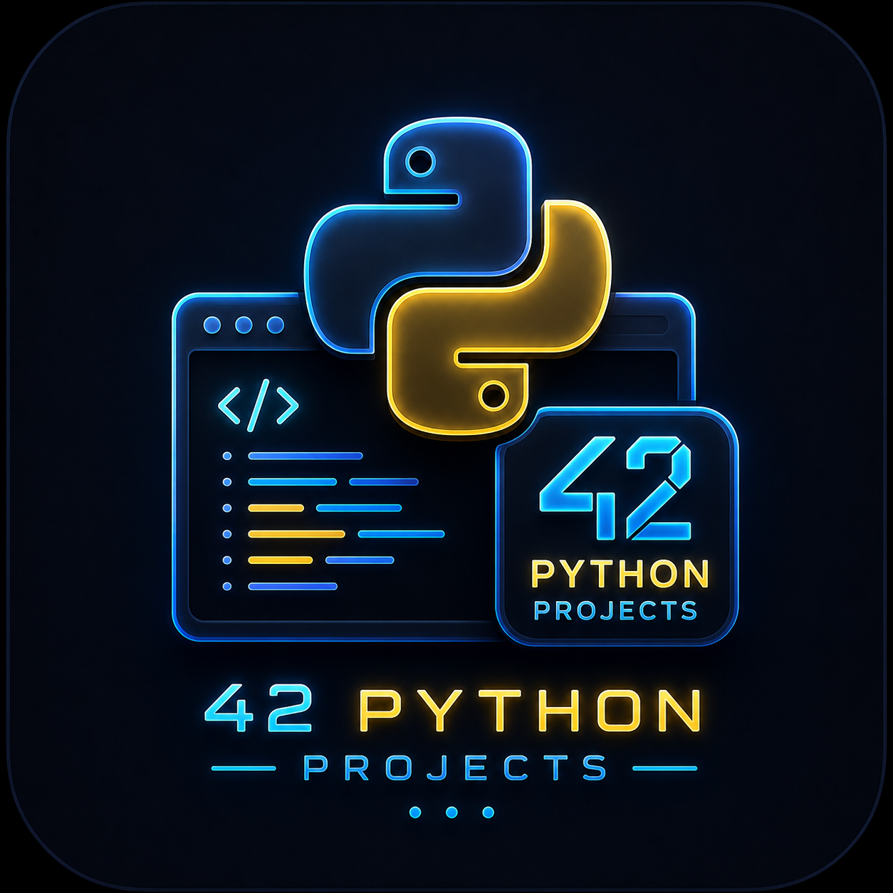
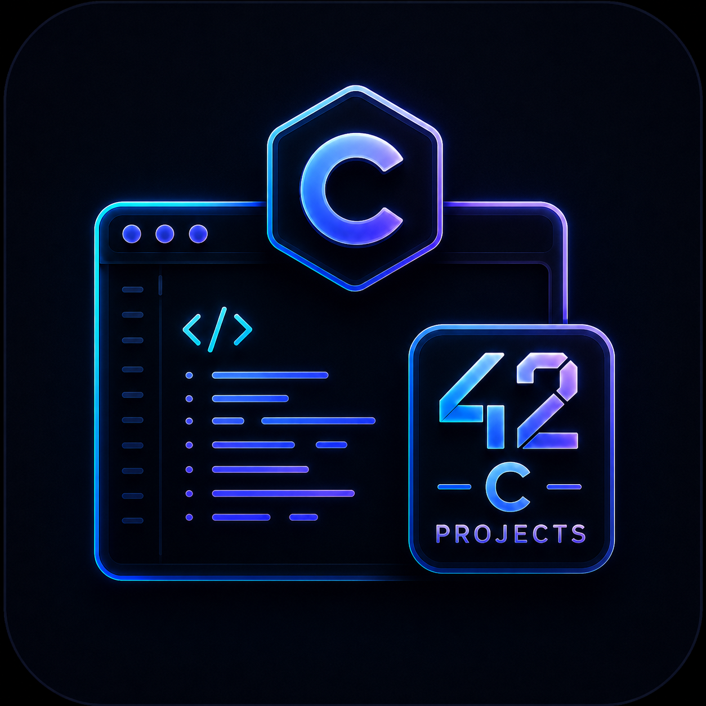

# 🚀 LeetCode Python Solutions

A collection of my Python solutions to LeetCode problems.

This repository is part of my continuous learning journey as a 42 School
student. I use LeetCode to strengthen problem-solving skills, deepen my
understanding of algorithms and data structures, prepare for technical
interviews, and reinforce concepts encountered throughout the Common
Core curriculum.

---

## 🔄 Automatic Synchronization

Solutions are automatically synchronized using **LeetHub v3**.

**LeetHub v3** is a browser extension that connects LeetCode with GitHub
and automatically pushes accepted submissions to a repository. This
allows me to keep a structured archive of solved problems while tracking
my progress over time.

📥 **Install LeetHub v3:**

  

---

## 🌌 Explore My Learning Collections

  
  

  
  

  Click any icon to explore the collection.

---

## 🎯 Objectives

-   Improve algorithmic thinking
-   Practice Python consistently
-   Strengthen understanding of data structures
-   Prepare for technical interviews
-   Complement my 42 Common Core journey
-   Track long-term progress and learning

---

## 📈 Learning Journey

This repository is not only a collection of accepted solutions but also
a record of my growth as a developer.

By solving problems regularly, I aim to:

-   Develop cleaner and more efficient solutions
-   Explore different approaches to the same problem
-   Improve time and space complexity awareness
-   Build strong problem-solving habits

---

⭐ If you're also learning algorithms, preparing for technical
interviews, or following the 42 curriculum, feel free to explore the
solutions and compare different approaches.

